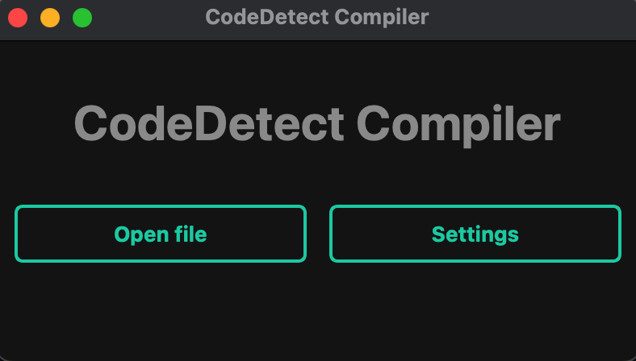

# CodeDetect-Compiler
CodeDetect Compiler is an application designed to convert program code images into executable files using advanced technologies in the field of optical character recognition (OCR) and code compilation. The program provides an intuitive graphical interface, which makes the process of converting code into executable files fast and convenient.

# Quickstart
Install Code Detect Compiler with [pipx](https://github.com/pypa/pipx), and start the app:
```bash
git clone https://github.com/anlix-y/CodeDetect-Compiler
cd CodeDetect-Compiler
poetry install
pip install PyQt5
```
# Installation
Install for [Windows](https://drive.google.com/file/d/1rdnDyA7ZBGuAN2uG9i3AOnSwrPllhCKA/view?usp=sharing)
